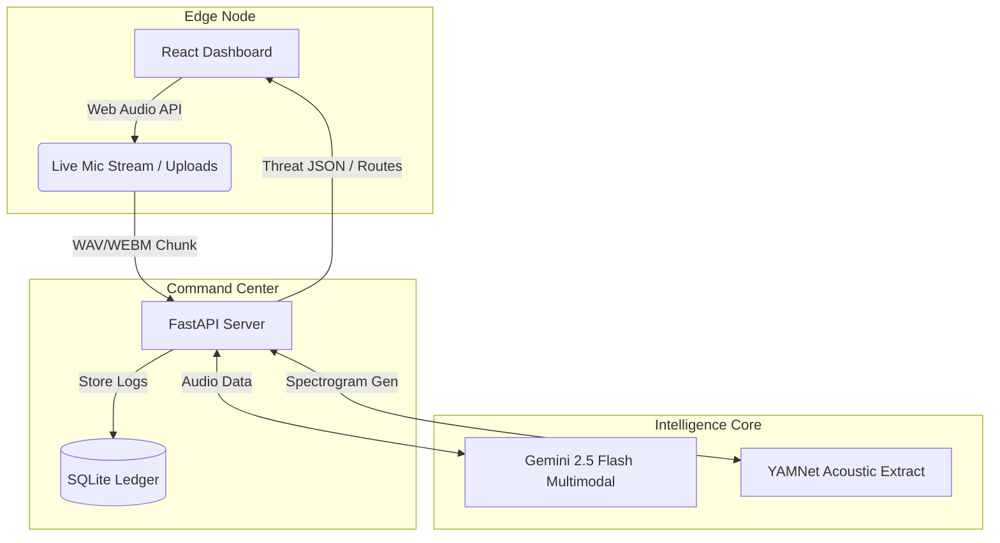
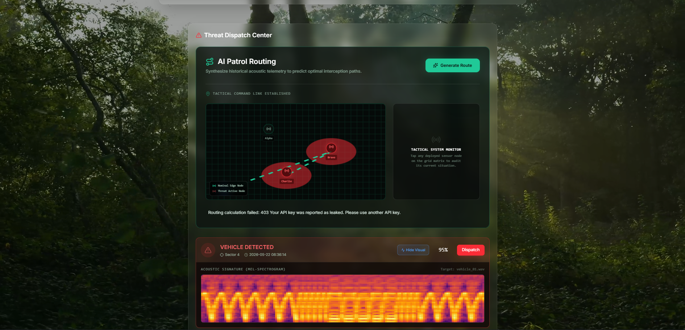
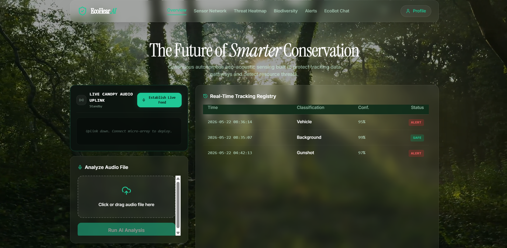
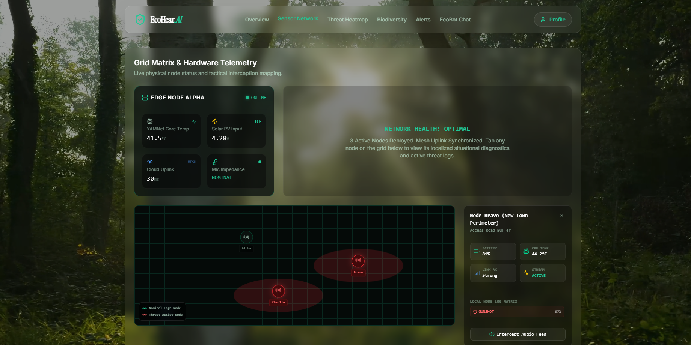
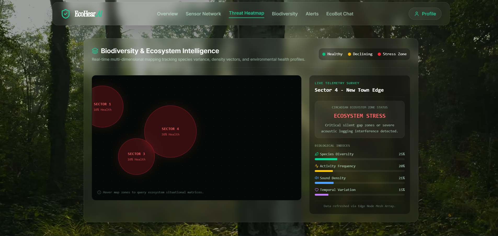

# EcoHear-AI 🎧🌱
Continuous autonomous eco-acoustic sensing built to protect tracking data pathways and detect resource threats.
YouTube Demo Link:

# 📌 The Problem:
Monitoring biodiversity—the delicate balance of animals, birds, insects, and plants in an ecosystem—is critical for tracking species health and detecting illegal activities. However, traditional manual monitoring faces severe logistical roadblocks:
Vast Scale & Constant Need: Forests are simply too huge for humans to monitor 24/7.
High Costs & Low Visibility: Manual observation is prohibitively expensive, and endangered animals are incredibly difficult to spot.
Delayed Response: Because of these blind spots, critical species often disappear entirely before researchers even notice a decline.

# 💡 The Solution:
Current conservation efforts are fundamentally reactive. Relying on scheduled manual patrols or delayed camera traps means wildlife rangers are often relegated to gathering forensics hours—or days—after illegal logging or poaching has already occurred. Furthermore, visual surveillance is heavily limited by canopy cover, line-of-sight, and nighttime blindness.
EcoHear.AI shifts forest protection from a reactive forensic task to a proactive tactical interception
Ultimately, EcoHear.AI bridges the critical latency gap between an isolated forest event and human intervention. It provides wildlife commanders with the exact operational intelligence they need to deploy rapid-response intercept teams before the damage is irreversible.

# ✨ Key Features:
By treating the forest soundscape as a continuous, 360-degree telemetry stream, we bypass the physical limitations of visual tracking. Our platform deploys an autonomous acoustic radar grid capable of listening to the environment in real-time. Instead of acting as a simple trigger alarm, EcoHear operates as an Edge-to-Cloud command intelligence layer. It mathematically verifies acoustic anomalies at the edge, contextualizes them against long-term ecological health baselines, and immediately routes validated, geographically pinpointed threat data to command headquarters.

### Intelligent Audio Processing:  
It uses the captured audio by the sensors to classify if a natural phenomenon (i.e: chirping of a bird, roar of a lion etc. ) or if it is an illegal activity (such as: illegal deforestation, poaching, or like illegal exploitation of the forests )going on deep the forest without any specialized human monitoring 24*7.
### Threat Heatmap Dashboard: 
It maps the biodiversity score of each zone covered by the sensors. It’s color-coded, if any zone is very much threat prone, it will change its color accordingly and give an overview of a certain zone.
### Biodiversity Health Score: 
It also presents the overall biodiversity score of the whole zone.  It also observes the occurrence of the new undetected species, and also keeps track of how many times a sensor captures any kind of activity.
### Dispatching forest rangers & Predictive routing: 
If any threat is detected in any zone, it will generate a route that will give the maximum efficiency to the forest rangers to mitigating those threats, and if there are threats happening simultaneously, it will also generate the most effective and efficient path according to the incident’s seriousness. 
### ChatBot integration: 
Our solution also includes a chatBot for answering any type of general queries. 
Digital twin mapping: It maps the location of the sensors installed in the area and gives an overall health report of the sensors as well. As it is also color-coded, it will change its color according to the level of the threat. 
### Live audio capturing and monitoring: 
It also provides a feature that allows an user to get an classification report by giving an live audio input through microphones

# ⚙️ Architecture & Infrastructure:
EcoHear.AI operates on a hybrid Edge-to-Cloud architecture, designed to process heavy acoustic data locally while maintaining a real-time, low-latency tactical uplink to the command center. The system is divided into three core pillars: 
Here is a professional, highly technical overview of your architecture and infrastructure. You can copy and paste this directly into your README.md file. It is written to impress hackathon judges and recruiters by highlighting the enterprise-level design decisions you made.

# 🏗️ System Architecture & Infrastructure:
EcoHear.AI operates on a hybrid Edge-to-Cloud architecture, designed to process heavy acoustic data locally while maintaining a real-time, low-latency tactical uplink to the command center. The system is divided into three core pillars:
### 🧠 1. Machine Learning & Inference Engine
The intelligence layer uses a multi-model pipeline combining local Edge AI for rapid classification and Cloud LLMs for complex ecological reasoning.
 Acoustic Feature Extraction: Incoming audio is standardized to 16kHz mono waveforms using librosa. The audio is passed through Google YAMNet (via TensorFlow Hub) to extract rich, 1024-dimensional acoustic embeddings.
 Custom Downstream Classifier: The YAMNet embeddings are fed into a highly optimized, custom-trained downstream classifier that maps the acoustic signatures to specific forest labels using a custom Label Encoder.
 Thresholding & False-Alarm Mitigation: The system uses probability matrices to filter background noise, triggering threat alerts only when danger keywords (e.g., chainsaw, gunshot) exceed a strict 40% confidence threshold.
 Multimodal Generative AI (Gemini 2.5 Flash): Google Gemini acts as the central reasoning engine. It processes live audio/webm chunks for secondary multimodal threat verification, generates predictive 3-step patrol routes based on SQLite threat telemetry, and powers the natural-language "EcoBot" command assistant.
 Visual Proof Generation: A headless Matplotlib worker converts raw waveforms into high-resolution, Mel-Spectrogram thermal heatmaps for human-in-the-loop visual verification.
### ⚙️ 2. Backend & API (Edge Routing Layer)
The backend is built for speed, resilience, and asynchronous file handling, acting as the primary Edge Node gateway.
 Framework: Built on FastAPI (Python) running on a Uvicorn ASGI server. Chosen for its extreme performance and native asynchronous handling of heavy audio file I/O operations.
 Local Edge Ledger (SQLite): To survive harsh forest environments with intermittent internet, all telemetry and detection logs are saved to a local ecohear.db SQLite database. This ensures zero data loss during network drops and acts as the ground-truth context window for the Gemini AI.
 Live Stream Processing (/stream-predict): A dedicated endpoint designed to accept continuous, chunked FormData from the frontend. It isolates spectrogram rendering in fault-tolerant try/except blocks to guarantee the AI stream never crashes during live operations.
 Static Asset Mounting: The server dynamically mounts a public /uploads directory using StaticFiles, allowing the frontend to securely fetch generated spectrogram images in real-time.
### 💻 3. Frontend Client (Tactical Command Dashboard):
The user interface is a high-performance, state-preserving React application designed to act as a military-grade Command and Control (C2) center.
 Framework & Tooling: Built with React and bundled via Vite for rapid hot-module replacement and optimized production builds.
 Persistent DOM Architecture: Instead of traditional conditional unmounting, the dashboard uses a custom CSS hidden/block wrapper for tab navigation. This guarantees that live data arrays, Web Socket/Stream states, and AI chat histories remain fully cached in the browser when switching between tabs.
 Live Hardware Telemetry: The UI features a simulated "Digital Twin" integration, rendering dynamically fluctuating hardware constraints (Edge CPU Temp, Solar Voltage, Mesh Ping) to reinforce the IoT realism of the project.
 Web Audio API Streaming: The LiveStreamNode bypasses default browser noise-cancellation protocols (which normally suppress chainsaws/gunshots as "background noise"). It leverages the native MediaRecorder API to capture unfiltered audio/webm chunks on a precise 12-second "Tactical Pulse" loop, maintaining real-time surveillance without exceeding API rate limits.
 Styling & Data Visualization: Fully styled with Tailwind CSS and Framer Motion for smooth, cinematic animations. Complex data is rendered via custom interactive matrices, including a color-coded Biodiversity Heatmap and a coordinate-mapped Sensor Network grid.

# 🚀 Getting Started
### Prerequisites
Make sure you have the necessary runtime environments and package managers installed on your local machine to run the AI models and web servers.
### Installation & Run Instructions
Clone the repository:
 git clone https://github.com/arkapravamahapa/EcoHear-AI.git
 cd EcoHear-AI
### Setup the Backend & AI Environment:
cd ecohear-backend
# Install dependencies
 pip install -r requirements.txt
# Start the server
uvicorn main:app --reload

### Setup the Frontend:
 cd ..
 cd frontend
# Install dependencies
npm install
# Start the client
npm run dev

# 🔄 Workflow
## 🏗️ System Architecture

# 📸 Screenshots

 
 
 

# 🤝 The Team (Single Neuron)
Arghyakamal Mondal  
Arkaprava Mahapa  
Soumyadeep Das  
Mayukh Das

